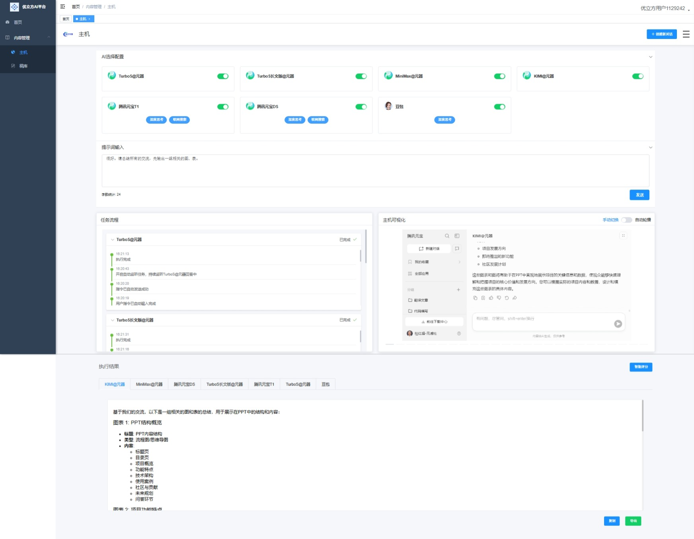
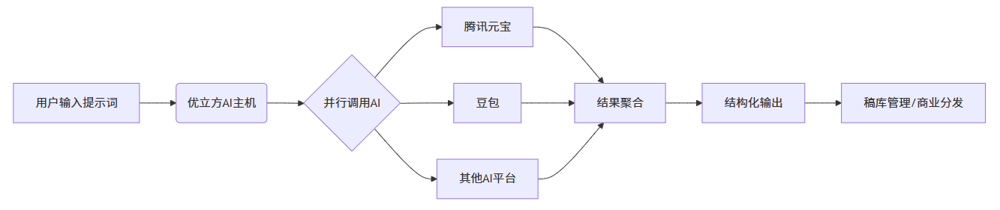
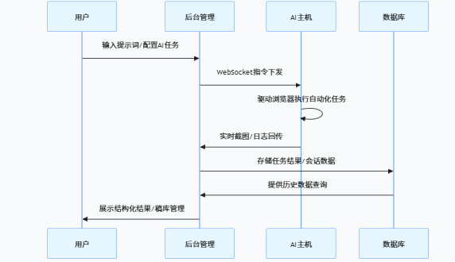

# U3W 优立方 AI 主机：人机协同数智驱动的团队未来

版本：2.05B

文档更新日期：2025年6月20日

## 1. 项目结构

```
U3W-AI/
├── common_deployment_guide.md  [公共环境部署指南](common_deployment_guide.md)
├── cube-mini/            # 优立方AI主机小程序控制端
├── cube-admin/           # 优立方AI主机控制台后端
│   └── deployment_guide.md  [部署指南](cube-admin/deployment_guide.md)
├── cube-ui/              # 优立方AI主机控制台前端
│   └── deployment_guide.md  [部署指南](cube-ui/deployment_guide.md)
├── cube-engine/          # 优立方AI主机核心服务
│   └── deployment_guide.md  [部署指南](cube-engine/deployment_guide.md)
├── cube-common/          # 公共工具模块
├── cube-framework/       # 框架核心模块
├── sql/                  # 数据库脚本
└── README.md             # 项目说明文档
```

## 2、概述

本白皮书详细介绍了该产品 —— 优立方 AI 主机。

秉承 “Unique³ Wisdom”（独特智慧三次方：团队智慧、AI 智慧、商业智慧）的品牌理念，优立方旨在通过融合前沿的 AI 技术与高效的团队协作能力，为企业提供高效、智能的内容资产创作与管理解决方案。

以核心的 “优立方 AI 主机开源版” 将作为技术的基石，以双许可证模式面向开发者社区和商业市场，而功能完备的 “优立方 AI 主机企业版” 则为企业客户提供开箱即用的智能化解决方案，助力他们在数字时代中实现效率飞跃与价值增长。

## 3. 优立方：品牌理念与核心价值

品牌名称：U3W 优立方

Slogan：Unique³ Wisdom（独特智慧三次方）

### 3.1 品牌理念：Unique³ Wisdom

“Unique³ Wisdom” 代表了优立方平台的三重智慧融合：

#### 3.1.1 团队智慧 (Team Wisdom)

平台构建的协作化工作流引擎，支持多成员协同创作，实现团队能力的数字化聚合。通过稿库管理、历史会话共享、多版本对比等功能，将分散的个体能力转化为结构化的团队资产，显著提升组织协同效率。

#### 3.1.2 AI 智慧 (AI Wisdom)

平台深度集成并不断扩展 AI 能力（如深度思考、联网搜索、多模态 AI），赋予机器智能决策和内容生成的能力。通过腾讯元宝、豆包等多源 AI 账号聚合，实现 “提示词→智能生成→内容优化” 的闭环，让 AI 成为团队创作的智能引擎。

#### 3.1.3 商业智慧 (Business Wisdom)

平台通过将 AI 能力与团队协作模式深度应用于实际商业场景（如内容营销、数据洞察），帮助企业提升效率、降低成本、优化决策，最终实现商业价值的增长。依托自动化内容分发、多平台适配等功能，将团队创作成果高效转化为商业产出。

### 3.2 核心价值主张

* **极致效率**：通过团队协作流程数字化，减少重复沟通成本，加速内容生产和业务流程。
* **智能赋能**：融合前沿 AI 技术，为团队提供智能内容创作、分析和优化能力，提升创意产出质量。
* **灵活定制**：模块化架构支持按需部署与深度集成，满足企业个性化团队协作需求。
* **可见可控**：实时可视化监控任务执行与协作进度，确保团队流程透明可控。
* **数据资产化**：系统化管理团队生成内容与协作数据，形成可复用的企业知识资产。

## 4. 产品家族与市场定位

优立方平台提供两种核心产品形态，以满足不同用户群体的需求：

### 4.1 优立方 AI 主机开源版

#### 4.1.1 产品定位

悟空共创旗下优立方 AI 主机的核心协作化自动化开源引擎。它是优立方 AI 主机技术实力的基石，也是连接开发者社区的桥梁。

#### 4.1.2 目标用户

个人开发者、开源贡献者、技术爱好者、非商业项目、高校科研机构。

#### 4.1.3 核心功能




基于 Java 和 Playwright 的浏览器自动化控制核心，支持团队协作基础能力：

##### 4.1.3.1 一问多答功能

支持用户扫码授权后，将腾讯元宝、豆包、腾讯元器智能体等 AI 账号的使用权配置给主机使用。当用户配置完成后，主机代理用户访问这些 AI 账号，用户只需输入一次提示词，主机即分别向 AI 转发这些提问，并获取 AI 的回答，供团队成员共享使用。

##### 4.1.3.2 多 AI 账号扩展

后续将陆续支持集成更多的 AI 账号，为团队提供多元化智能能力支持。

##### 4.1.3.3 标准化接口

提供标准化的 REST API 接口，用于驱动浏览器执行任务并返回结构化数据，方便团队进行二次开发与系统集成。

##### 4.1.3.4 能力扩展支持

即将支持 MCP、本地数据输出和 OpenAI API 简化接口等能力，提升团队协作中的数据互通效率。

##### 4.1.3.5 执行过程可视化

支持执行过程截图的本地化存储，便于团队成员追溯任务执行细节。

##### 4.1.3.6 结果结构化输出

返回最终任务结果（当前支持 Markdown，部分AI支持 HTML 片段），满足团队内容创作的标准化需求。

##### 4.1.3.7 独立部署能力

不依赖特定上游系统，便于团队独立部署与二次开发，快速适配个性化协作场景。

##### 4.1.3.8 单台主机可同时运行多个优立方账号

每个优立方账号均可以绑定它自己的多组AI账号，同时，每台主机都支持多个优立方账号同时运行。

#### 4.1.4 授权模式

实行双许可证模式：

##### 4.1.4.1 开源许可证

面向个人开发者和非商业用途，允许自由使用、修改和分发核心代码，不收取任何费用。

##### 4.1.4.2 商业许可证（衔接企业版）

当企业需要将其集成到商业产品或服务中时，需通过购买优立方 AI 主机企业版获得商业授权。

#### 4.1.5 价值主张

免费提供强大的核心协作自动化能力，降低技术门槛，激发开发者创新，同时为企业版培育潜在用户和技术影响力。

### 4.2 优立方 AI 主机企业版

#### 4.2.1 产品定位

悟空共创旗下优立方品牌的旗舰产品，一个 AI 驱动的智能内容创作与团队管理一体化平台。

#### 4.2.2 目标用户

各行各业需要提升内容生产效率、实现团队协作自动化的企业、机构及商业用户。

#### 4.2.3 核心功能（包含优立方 AI 主机的所有能力）

##### 4.2.3.1 完整后台管理平台

提供用户管理、权限控制、系统设置、业务逻辑处理等功能，支持团队成员角色分工与权限精细化管理。

##### 4.2.3.2 企业级数据存储

采用 MySQL 5.7 数据库和 Redis 5.0，确保团队协作数据安全与高效访问，支持多人同时在线协作。

##### 4.2.3.3 WebSocket 实时通信

实现任务流程的实时反馈和主机可视化执行界面（实时回传浏览器截图），团队成员可同步监控任务进度。

##### 4.2.3.4 远程结果存储

将所有任务结果自动入库，支持历史会话查询与追溯，形成团队共享的知识储备库。

##### 4.2.3.5 全功能内容管理

###### 4.2.3.5.1 AI 选择与配置

灵活选择 AI 能力（深度思考、联网搜索、智能体等），为团队提供丰富的智能创作工具。

###### 4.2.3.5.2 提示词输入区

直观引导 AI 任务执行，支持团队成员共享提示词模板，提升协作效率。

###### 4.2.3.5.3 智能评分机制

对 AI 结果进行再处理、优化，支持团队内部对内容质量进行协同评审与迭代。

###### 4.2.3.5.4 稿库管理

自动化内容归档，形成企业专属知识库，支持团队成员按权限访问、复用历史内容。

##### 4.2.3.6 深度应用场景

支持复杂的商业场景（如公众号内容全流程创作、跨平台内容多语言优化与分发），满足团队在不同业务场景下的协作需求。




##### 4.2.3.7 商业授权

可在企业环境中部署、定制（支持更换 Logo、名称），并获得悟空共创提供的完整部署指导、企业级技术支持与更新服务。

#### 4.2.4 价值主张

提供一个开箱即用、功能完备、稳定可靠的商业解决方案，帮助企业实现内容生产的团队化、智能化，显著提升运营效率和市场竞争力。

## 5. 系统架构与技术实现

优立方 AI 主机采用先进的模块化、分布式架构，确保高效率、高稳定性和易于扩展性。


### 5.1 整体架构概览

优立方 AI 主机主要由以下三大核心组件构成，它们分别部署在不同的环境中，实现功能解耦和高性能协作：

#### 5.1.1 后台管理平台

系统的 “大脑”，负责业务逻辑、数据中转和用户交互，支持团队协作流程的数字化管理。

#### 5.1.2 数据库服务器

系统的 “记忆”，提供核心数据存储和高速缓存，保障团队协作数据的安全与高效调用。

#### 5.1.3 优立方 AI 主机

系统的 “执行者”，负责核心的 AI 驱动浏览器自动化任务，支持团队任务的自动化执行与结果回传。

### 5.2 核心组件技术栈与部署

|  |                                                |  |  |
| --- |------------------------------------------------| --- | --- |
| 模块名称 | 核心技术栈                                          | 部署环境 | 主要职责 |
| 后台管理平台 | 若依（RuoYi）框架、Java 17 (Spring Boot)、Vue.js、Nginx | Linux 服务器 | 业务逻辑处理、权限管理、数据接口、前后端交互、与优立方 AI 主机进行 WebSocket 通信，支持团队协作流程管理 |
| 数据库服务器 | MySQL 5.7 (utf8mb4)、Redis 6.x                  | Linux 服务器 | 核心业务数据存储、会话管理、高速缓存、数据备份与恢复，支持团队数据共享 |
| 优立方 AI 主机 | Java 17、Playwright                             | Windows 主机 | 浏览器自动化控制、模拟用户行为、AI 任务指令执行、执行过程截图与日志回传、未来集成多源 AI 能力，支持团队任务自动化执行 |

### 5.3 模块间协作与数据流




优立方 AI 主机各模块之间通过标准化的通信协议和接口紧密协作，形成高效的数据流闭环：

#### 5.3.1 用户指令发起

用户通过后台管理平台的用户界面，输入指令或配置 AI 任务（如提示词、AI 模型选择），支持团队成员协同输入与任务规划。

#### 5.3.2 指令下发

后台管理平台将指令通过 WebSocket 推送至优立方 AI 主机，支持团队任务的批量分发与进度跟踪。

#### 5.3.3 智能任务执行

优立方 AI 主机接收指令并驱动浏览器执行自动化任务。在此过程中，可能调用集成的各种 AI 服务进行深度思考、联网搜索或内容生成，满足团队智能化协作需求。

#### 5.3.4 实时反馈与结果回传

任务执行过程中的实时日志和浏览器截图通过 WebSocket 持续回传至后台管理平台，供团队成员实时监控。最终任务执行结果（如 Markdown 格式的内容、HTML 片段、结构化数据）也通过 WebSocket 或 REST API 回传，实现团队信息同步。

#### 5.3.5 数据存储与管理

后台管理平台接收到的任务结果、执行日志、历史会话以及用户相关数据等，均存储至 MySQL 数据库。Redis 则用于高效管理实时会话状态和提供数据缓存，支持团队数据资产的系统化管理。

#### 5.3.6 结果展示与内容管理

后台管理平台将存储的数据进行可视化展示（如 Markdown 渲染），并提供稿库管理、历史会话查询、智能评分等功能，形成完整的团队交互和内容资产管理闭环。
