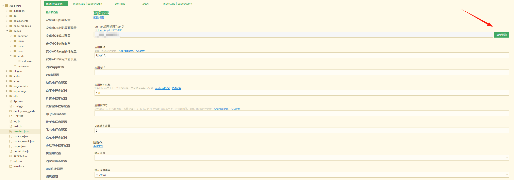
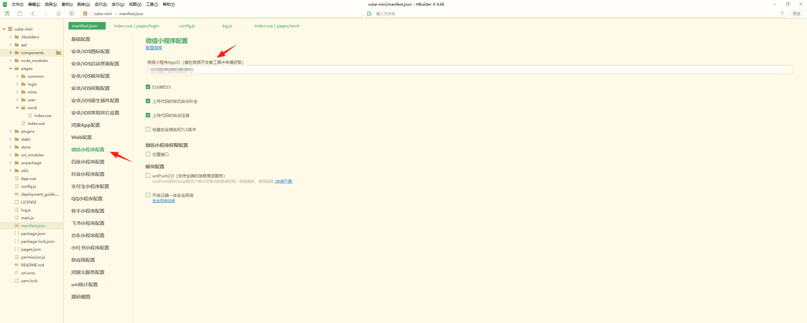

## cube-mini 部署指南

### 前置要求
请先完成 [公共环境部署](../common_deployment_guide.md) 中的所有步骤，包括 Node.js、npm 的安装和项目仓库克隆。

### 环境要求
- Node.js (v16.x)
- npm
- HBuilderX
- 微信开发者工具
- Windows 10系统及以上 (64位)
- 微信小程序AppID以及AppSecret

### 部署步骤
1. **验证 Node.js 安装**
   - 打开命令提示符(CMD)或 PowerShell
   - 执行命令验证 Node.js 版本: `node -v`
   - 确保输出版本号与要求一致

2. **进入项目目录**
   ```bash
   cd cube-mini
   ```

3. **安装项目依赖**
   ```bash
   npm install marked
   ```

4. **导入项目到HBuilderX**
   1. 打开HBuilderX，点击菜单栏「文件」→「导入」→「从本地目录导入」
   2. 选择项目根目录下的`cube-mini`文件夹，点击「确定」完成导入
   3. 导入成功后，在项目列表中展开`cube-mini`目录

5. **配置小程序基础信息**
   1. 双击打开`manifest.json`文件
   2. 在「基础配置」选项卡中：
      - 找到「uni-app应用标识」，点击右侧「重新获取」按钮
      
   3. 在「微信小程序配置」选项卡中：
      - 找到「AppID」输入框，填写您的微信小程序AppID
      
   4. 保存文件（快捷键Ctrl+S）

6. **修改配置文件**

#### 6.1 配置小程序AppID
编辑 `<项目根目录>/cube-mini/pages/login/index.vue` 文件，设置小程序AppID：
前往https://mp.weixin.qq.com/登录获取AppSecret并进行配置
```
// 用户注册开关
				register: false,
				globalConfig: getApp().globalData.config,
				wxLoginForm: {
					appId: "<APPID>",
					appSecret: "<APPSECRET>",
```

#### 6.2 连接后端
编辑 `<项目根目录>/cube-mini/config.js` 文件，修改baseUrl为自己的域名：
```
// 应用全局配置
module.exports = {
	//生产
	baseUrl: 'http://127.0.0.1:端口',
```

#### 6.3 配置WebSocket地址
编辑 `<项目根目录>/cube-mini/pages/work/index.vue` 文件，修改wsurl为自己的域名：
```
// 使用PC端的WebSocket连接方式
			const wsUrl = `${process.env.VUE_APP_WS_API || 'ws://127.0.0.1:端口/websocket?clientId='}mypc-${this.userId}`;
```
#### 6.4 运行项目
打开微信开发者工具登录后，点击HBuilderX菜单栏「运行」→「运行到小程序模拟器」→「微信开发者工具-[cube-mini]」，即可在微信开发者工具运行项目。

### 常见问题
1. 如果没有绑定第三方平台则无法获取到unionId，跟给出的数据库管理员账号是无法对应的，需要自行在数据库修改corpId。